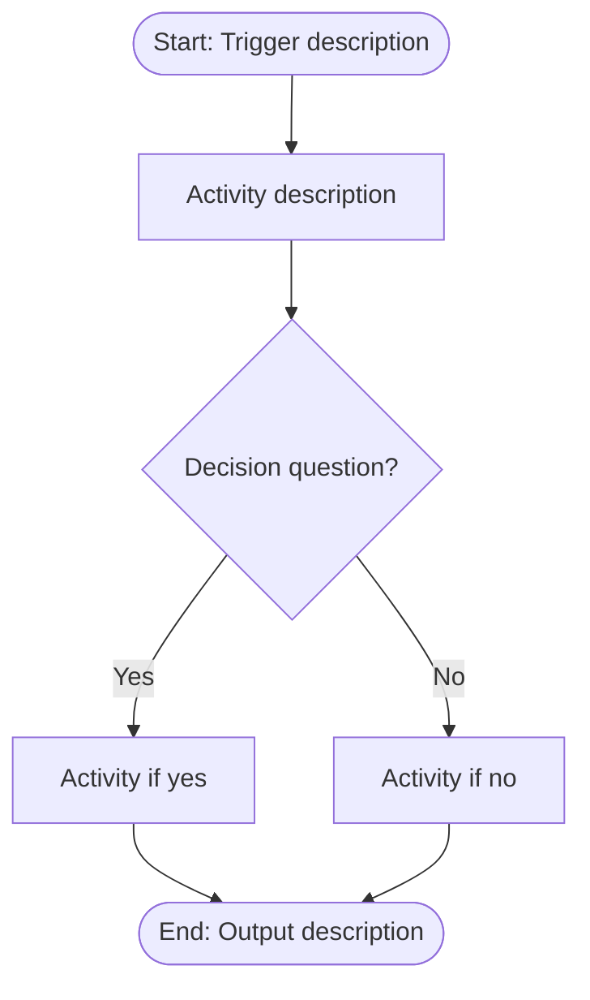
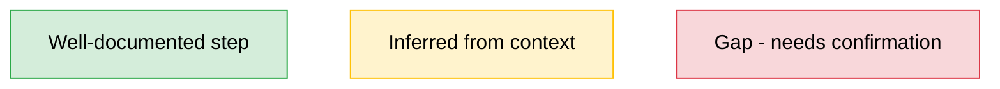
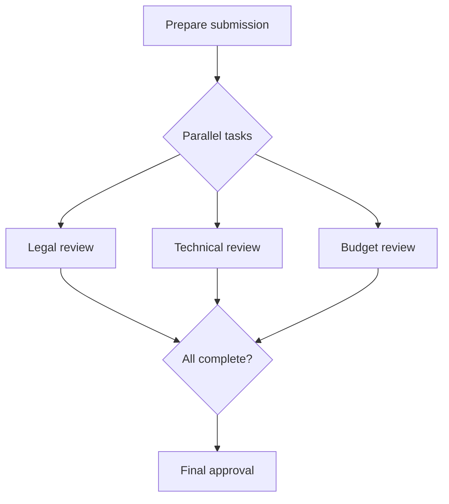
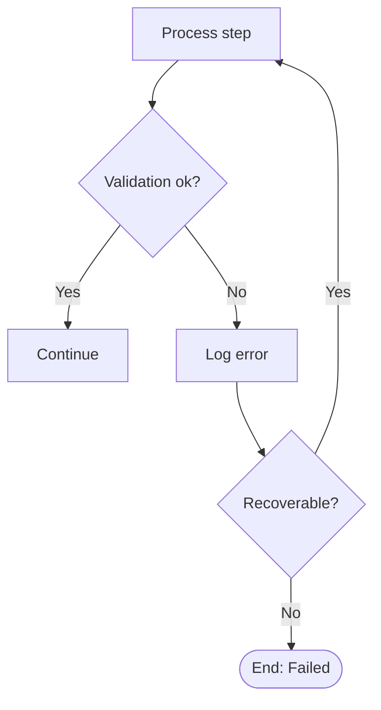
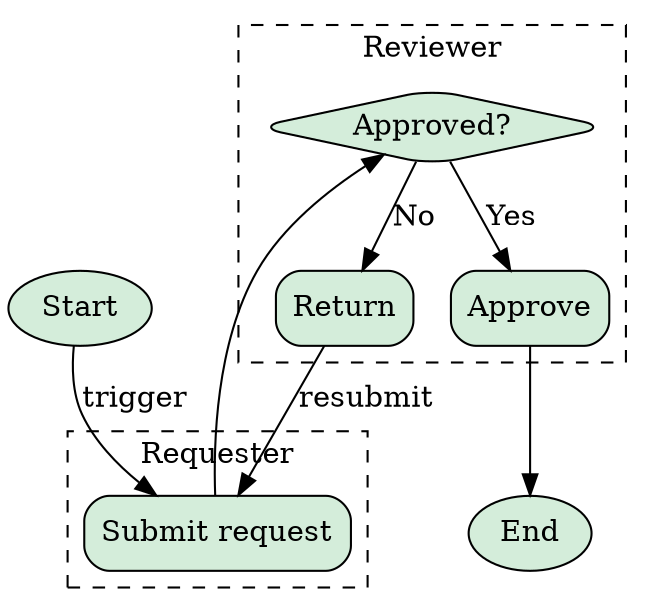

# Process Map Notation Guide

Mermaid flowchart syntax for process maps generated by the process-mapper skill.

---

## Basic Structure



## Node Shapes

| Shape | Syntax | Use For |
|-------|--------|---------|
| Stadium (rounded) | `([text])` | Start and end events |
| Rectangle | `[text]` | Activities / process steps |
| Diamond | `{text?}` | Decision points |
| Parallelogram | `[/text/]` | Data input/output |
| Hexagon | `{{text}}` | Subprocess (expanded elsewhere) |
| Circle | `((text))` | Connector / reference point |

## Swimlane Subgraphs

Use subgraphs to represent different actors or departments:

```mermaid
flowchart TD
    subgraph Requester[Requester]
        A[Submit request]
    end

    subgraph Reviewer[Team Lead]
        B{Meets criteria?}
        C[Approve]
        D[Return with feedback]
    end

    subgraph System[Automated System]
        E[Send notification]
        F[Update database]
    end

    A --> B
    B -->|Yes| C
    B -->|No| D
    C --> E
    E --> F
    D --> A
```



## Confidence Color Coding

Apply CSS classes to indicate confidence level:



- **Green** — HIGH confidence. Explicitly stated in source material.
- **Yellow** — MODERATE confidence. Inferred or partially described.
- **Red** — LOW confidence. Unresolved gap or assumption.

## Edge Labels

```
A -->|condition| B        %% Labeled edge
A -.->|optional| B       %% Dotted edge (optional path)
A ==>|critical| B        %% Thick edge (critical path)
A -->|exception| Error    %% Exception path
```

## Parallel Paths

Use a fork/join pattern for parallel activities:



## Exception Handling

Show exception paths branching off the main flow:



## Layout Tips

1. **Keep node labels under 40 characters.** Put detail in the process-steps table.
2. **Use `TD` (top-down) for most processes.** Switch to `LR` (left-right) for very linear flows.
3. **Limit to ~20 nodes per diagram.** For larger processes, split into sub-process diagrams linked by hexagon nodes.
4. **Group related steps in subgraphs** even if the same actor — helps visual clustering.
5. **Number nodes** to match the Step ID in process-steps.md: `S1[Step 1: Description]`

## Rendering Commands

```bash
# Render Mermaid to SVG
mmdc -i process-map.mmd -o process-map.svg -t neutral -b transparent

# Render Mermaid to PNG (if needed for slides)
mmdc -i process-map.mmd -o process-map.png -t neutral -b white -s 2

# Fallback: Graphviz for complex layouts
dot -Tsvg process-map.dot -o process-map.svg
dot -Tpng -Gdpi=200 process-map.dot -o process-map.png
```

## Graphviz Fallback

For processes over 20 steps where Mermaid layout degrades, use Graphviz DOT:


